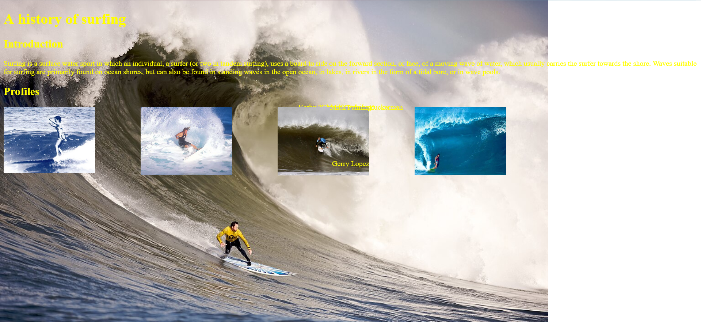

## Webpage design personally hates me

I'm not going to lie, it always bothered me when I ran into bad-looking UI on the websites or the video games I played. I always thought to myself "Oh, there's no way it's that hard to make something that actually looks decent, right? Especially with all the examples everywhere of actually pretty menus and stuff, how are people still making stuff that looks like it's from the early 2000's?" 

As it turns out, it's not only hard, it's frustratingly annoying.

All the times I got annoyed at Word for messing up the format and layout of my papers whenever I tried to shift an image around did *not* prepare me for how much more annoying it is when trying to figure out how to place an element on a page.

Try to include a column? Your images? Gone. The text? Halfway across the world. It almost seems spiteful at times, like some sort of malicious spirit. I'd be more upset if it honestly wasn't kind of funny.

Just look at this. What do I even do with this???

## Standardized design

Despite all this, learning [Bootstrap 5](https://getbootstrap.com/) has been valuable in my learning of web design. One of the greatest strengths of it is that it provides software engineers a framework that provides them with some baseline tools to help standardize everything.

That way, software engineers can take a look at a website's internal code, see that it's made with Bootstrap, and have a better understanding of how everything is put together and made. With that understanding, it makes it even easier to reference for their own web design, which is especially important for students like me who are still trying to figure out how to put everything together on a base level. 

It also allows for students who are still learning to have some basic formatting provided for them. One of the more frustrating aspects of learning HTML and CSS was trying to figure out to make everything go to where I wanted it to be. Nothing seemed to cooperate, but with Bootstrap 5, those concerns were alleviated just a bit.

For example, here are my attempts at putting together a recreation of a website. 

Although the recreation is by no means perfect, it's still miles ahead of where I started, and a good example of how a little help comes a long way.
