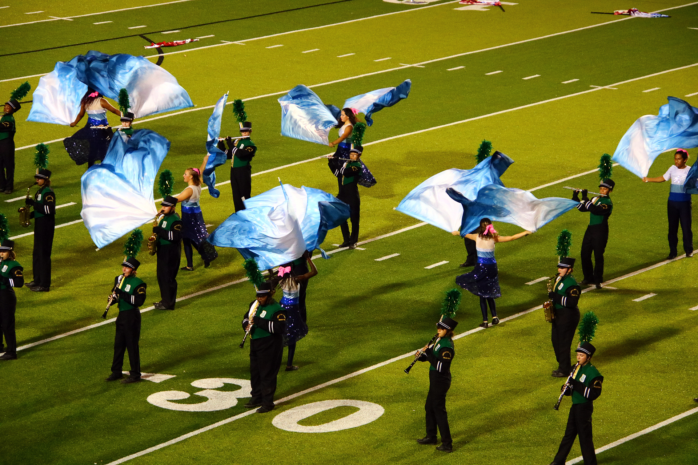

## Timing and teamwork

I did color guard from high school to college for about six years, and it gave me a comprehensive look into how to cooperate and communicate with my peers in a team-based setting. 

Color guard requires highly specific timing. Being off by even half a second is noticeable when one is waving around a brightly colored flag or rifle, and so being off by even half a second makes you and your entire team liable to getting yelled and swore at by your very, very upset guard instructor who's done this for longer than you've been alive. Repeat this with about 30-40 other color guard members, and it becomes clear that communication is key to this activity. (I swear to god that just typing this is giving me flashbacks.)

To succeed, it was necessary for everyone to coordinate with everyone else to ensure that we were all on time, that we all knew the choreography and dance, and that we were able to stay in sync with not just each other, but the rest of the marching band as a whole. This requires a lot of talking, a lot of critiquing, and a lot of social skills to ensure that there were no hurt feelings and that everyone knew what we were doing while also maintaining our morale. Trust me, it was very easy to lose motivation when it feels like you're being yelled at every single day of practice. So by the end of it, I was better equipped to working, talking, and socializing with other members of a team in a clear, comprehensive way such that everyone comes out on top and that we all succeed.

