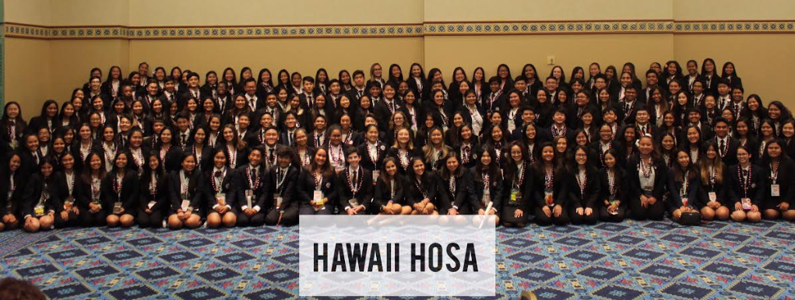

HOSA, standing for Health Occupations Students of America, is an orginization that specializes in helping students who plan on entering various healthcare positions to better prepare for their future professional careers. One such way of doing so is in the form of competitive events where students present to a panel of real healthcare professionals in a 3 day long event.

Back when I was studying to enter the medical field, I entered one of the HOSA competitions. My team and I were given multiple prompts to respond to related to various situations that one would have to deal with in the medical field, and we were given a 12 hour period to create a presentation as to how we would respond to and address each one of these prompts according to how a real medical professional would, following medical guidelines. We split up the work, and I worked on my own prompt before we switched off and looked over each other's work in a different prompt, offering corrections and critique. After the 12 hour period was up, we were no longer allowed to continue our work, and we were to submit what we had. Although our work was technically done, we still needed to spend the night preparing for how we would go about our presentation, and rehearsing what we would say from memory. The day after, we presented to the panel of medical professionals and did our best to explain our thought processes and reasonings for each of our decisions. 

This event gave me a formal experience in seeing how I operate under a time limit with a team, and allowed me to see how well I stand up to that pressure. Although I would change career paths, it was still a valuable experience working with others.

