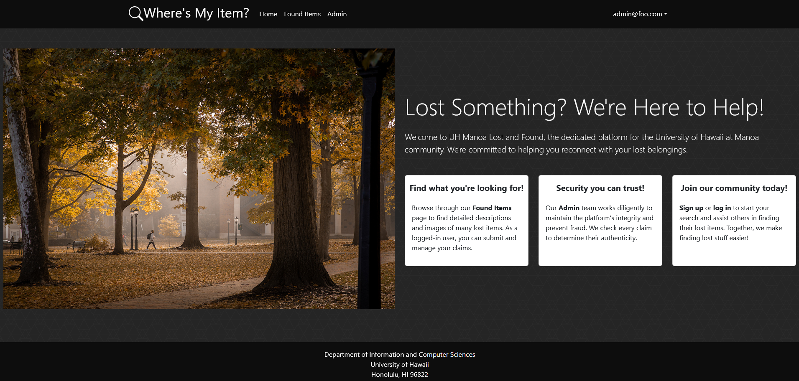
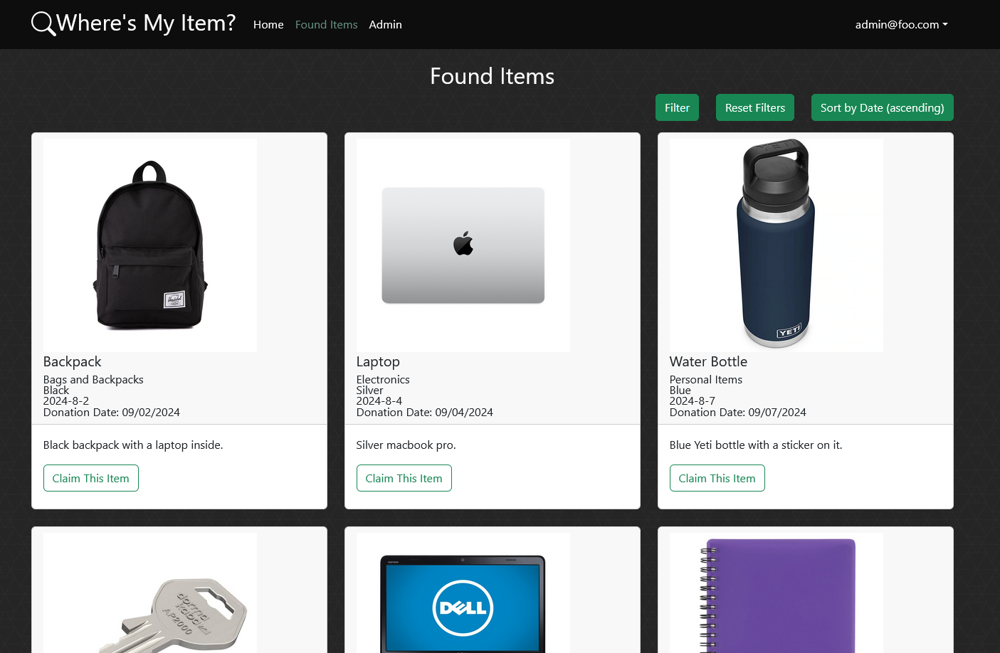
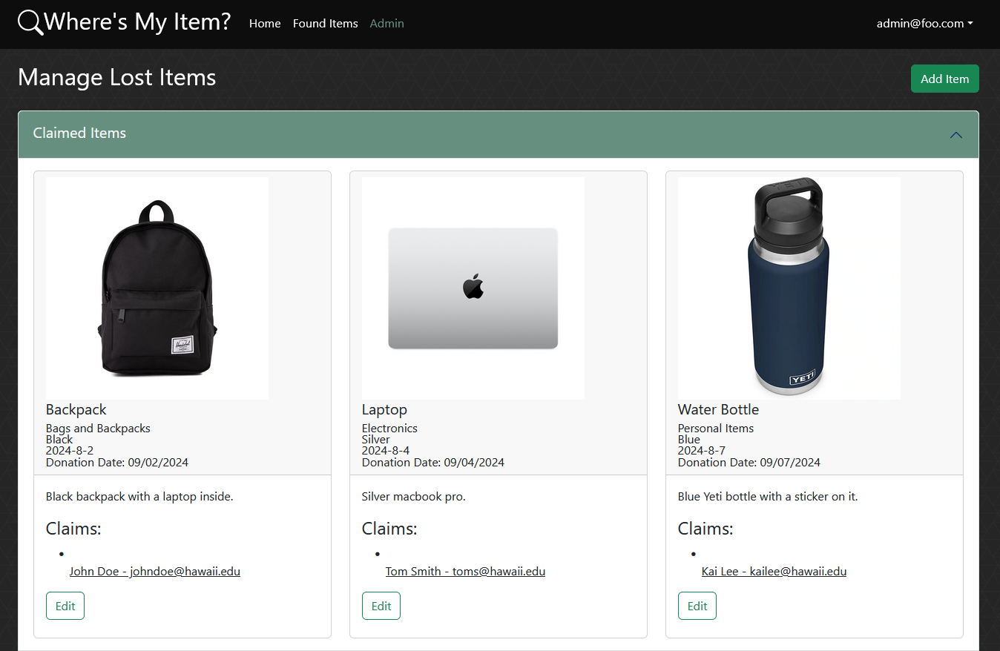
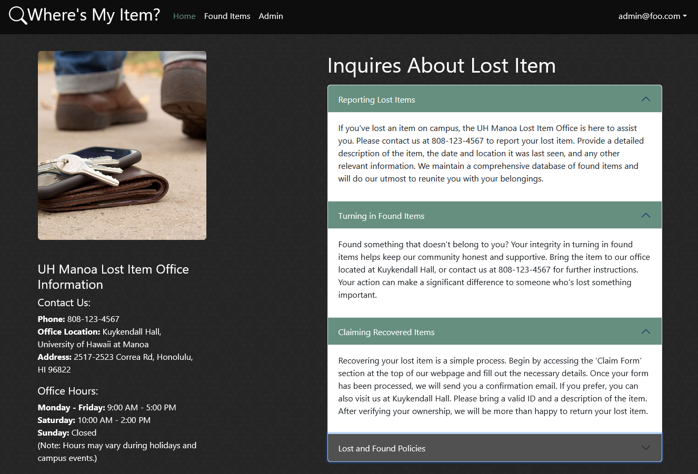
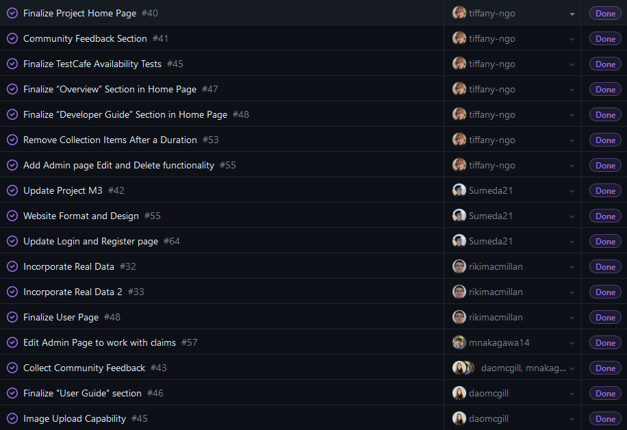

## Website overview

In ICS 314, one of the main projects that we had to do near the end of the semester include creating a website to fulfill some sort of purpose. In our case, we did a website, called ["Where's My Item?"](https://uh-manoa-lost-and-found.online/), that was meant to belong to the UH Manoa Lost Item office, and helped students find any lost items that were missing on campus. 

Accounts with admin priveleges were able to upload the lost items that were delivered to the Lost Item office, and students or faculty that logged in were able to navigate to a page that contained every lost item in the database. They could filter the items according to color, type of item, or the date that it was found, and if they found something that belonged to them, could then submit a claim form. 

The claim form contained forms for entering pertinent details that could confirm their ownership of the item, and once done, admins could then click on these claim forms and verify whether the claim form looked legitimate.

There was also a FAQ page that informed users about the functionality of the site and information regarding the Lost Item office, such as location or office hours, and detailed how the items, if not claimed, would be donated within 31 days.

If you wish to learn more about the source code, here is our [GitHub page](https://github.com/orgs/wheres-my-item/repositories) for the project.

## My contributions

Our team divided the work that we did into multiple tasks, and pinned these tasks onto project boards to help organize and keep track of which tasks we had to finish and who was responsible for them.

In my case, in regards to the functionality of the site, I worked on landing page, worked on the CSS elements, added functionality to the Admin page's Edit and Delete buttons, and made it so that items would be purged from the database after 31 days, signifying when it was time for the item to be donated. 

Other responsibilities of mine included adding to and updating the project's [home page](https://wheres-my-item.github.io/), collecting community feedback and forming it into an organized report, and creating TestCafe availability tests to make sure the pages of the site worked on a basic level.

## A good lesson to learn

